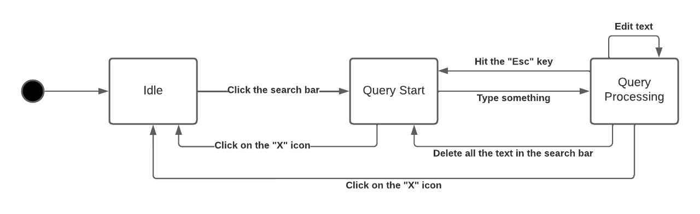
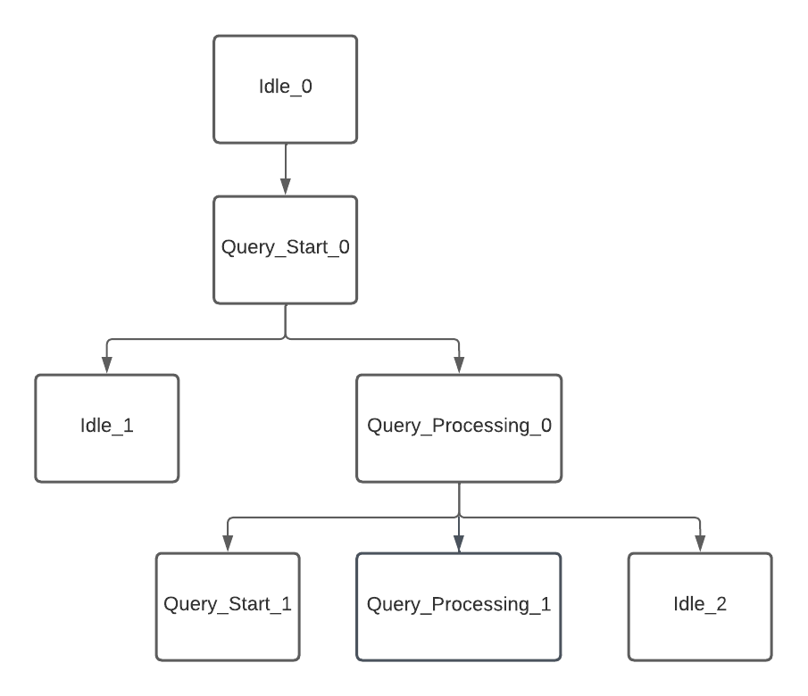

# Assignment #4

## Group Information

- Degree: M.EIC
- Group id: 06
- Project id: 03
- Students:
    - João Matos, up201703884
    - Tiago Gomes, up201806658

## Use cases
- Create a task without a context or a project
- Mark a task as done
- Search for task's text

The first two use cases were chosen because they represent the main functionality of the application, which is to create a list of tasks that can be marked as done. The last one was chosen because it's useful for a user to be able to find previously written tasks. By testing these use cases, we make sure that they are working properly.

## Create a task without a context or a project

### State Machine

The idle state is the application initial dashboard, where it's possible to see the projects, categories and list of tasks, as well as create new ones. It's possible to create a new task by clicking on the new task text field, where it's possible to choose its title. It's also possible to choose a priority, by clicking on the priority field. When clicking the "+" button or hitting the "Enter" key, the task is created and it's possible to see it on the application dashboard. In this state machine there are 3 states, 8 transitions and 4 events.

### Transition Tree

The transition tree describes all the possible paths of this use case. There are 4 different paths.

### Transition Table

| States\\Events     | Click on text field | Click on priority field  | Click on "+" | Hit the "Enter" key | 
| ------------------ | ------------------- | ------------------------ | ------------ | ------------------- | 
| Idle               |     Task Text Edit  | Task Priority Edit       |              |                     | 
| Task Text Edit     |                     | Task Priority Edit       | Idle         | Idle                | 
| Task Priority Edit |                     |                          | Idle         | Idle                | 

The transition table of this use case allows us to identify the sneak paths, i.e., identify paths with unspecified behavior.

### Test cases

#### testCreateTaskWithoutPriority

This test aims to check if the create task feature is working properly when there is no associated priority. It starts by checking if the application is on the "Idle" state, by making sure the dashboard is visible and by typing some characters and checking if nothing happens. Then, it goes to the "Task Text Edit", by clicking on the "New Task" text and writing the name of the task. We test if the system is in fact in the "Task Text Edit" state by checking if the new task text is editable. Finally, we create the task, by clicking on the plus button. To test if the task was created, we check if the name we gave to the task is present on the tasks dashboard. Because we didn't gave a priority to the task, we also check if the task was created without a priority. The test passes, which means the feature is working as expected.

### testCreateTaskWithPriority

 This test aims to check if the create task with a priority feature is working properly. As the previous test, it starts by checking if the application is on the "Idle" state. Then, it goes to the "Task Text Edit" and checks if it's there. After that, it goes to the "Task Priority Edit", by clicking on the priority field and typing a priority, and checks that state by making sure the priority field is editable. It goes back to the "Task Text Edit" by clicking the task text field, goes again to the "Task Priority Edit" by clicking the priority field and finalizes de creation of the task by clicking the "Enter" key. Finally, it checks if the task was created, by checking the text and the priority of the created task on the tasks dashboard. The test passes, which means the feature is working as expected.

 

 ### testOtherTransitions

This test aims to test the transitions that were not used on the previous tests, namely:
- "Hit the Enter key", from "Task Test Edit" to "Idle"
- "Click the +", from "Task Priority Edit" to "Idle"
- "Click on priority field", from "Idle" to "Task Priority Edit"

The test passes, which means the transitions are working as expected.

## Search for a task's text

### State Machine

Like the previous use case, we start with the idle state, which is the state we get to by just opening the app. Here, if we click the search bar that field gains focus and we can start working on our query but no results are shown yet. Here, if we click the "X" icon in the corner of the bar, the bar loses focus and we go back to the initial state. However, if we start typing, only notes that match our query are shown, with the remaining ones being hidden. At this point, we are in a different state (query processing) and if we keep editing the query's text the results will change accordingly. If we hit the "Esc" key, we go back to the query start case where all the notes are shown again but the search field is still focused. Another way of going back to this state is by just deleting all the text in the search bar. Finally, if we click on the "X" icon again, we go back to the idle state. This state machine has 3 states, 7 transitions and 6 events.

### Transition Tree

This is the transition tree for this use case. There are 4 possible paths. We start in the idle state (Idle_0) and have no choice but to click the search bar and go to the query start state (Query_Start_0). At this point we can go back to the idle state (Idle_1) or go the query processing state (Query_Processing_0). In the query processing state we can go to one of the other 2 states (Query_Start_1 and Idle_2) or stay in the same state (Query_Processing_1).   

### Transition Table

| States\\Events  | Click the search bar | Type something   | Hit the "Esc" key | Edit text        | Delete all the text in the search bar | Click on the "X" icon |
| ---------------- | -------------------- | ---------------- | ----------------- | ---------------- | ------------------------------------- | --------------------- |
| Idle             | Query Start          |                  |                   |                  |                                       |                       |
| Query Start      |                      | Query Processing |                   |                  |                                       | Idle                  |
| Query Processing |                      |                  | Query Start       | Query Processing | Query Start                           | Idle                      |

This is the transition table for this use case. We can see that there are 11 sneaky paths.

## QF-Test Feedback

Overall, *QF-Test* proved to be very useful when creating test cases that require interaction with the UI. However, one problem that we found is that the configuration file used makes it harder to collaborate with other people when using the tool. The configuration file contains information that is specific to each developer's machine. We edited this file in an attempt to use it in a different machine. Unfortunately, *QF-Test* signs the configuration file and checks its integrity upon loading, making it impossible to use a file that's been edited. Perhaps, if the test suite data was stored in a separate file, it could be used with VCS, while the file with user specific information is ignored.