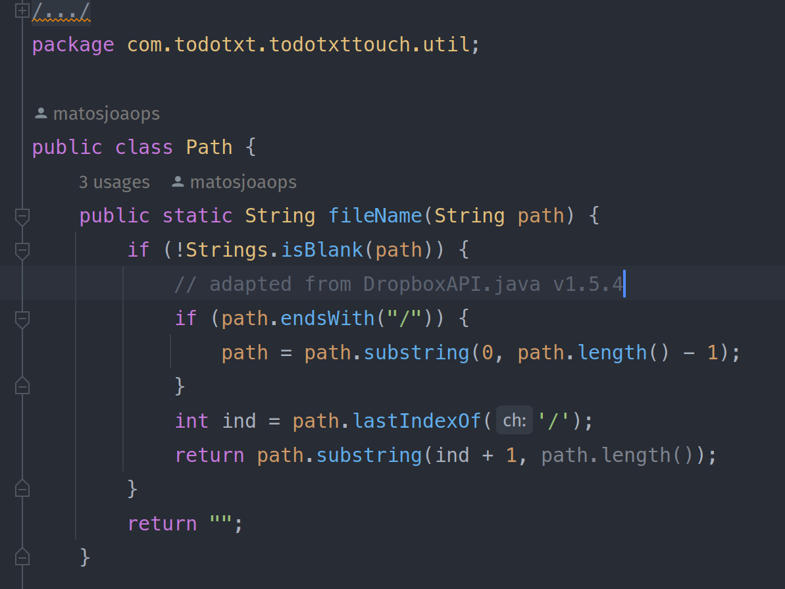
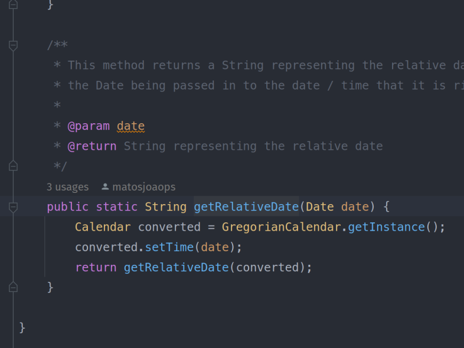
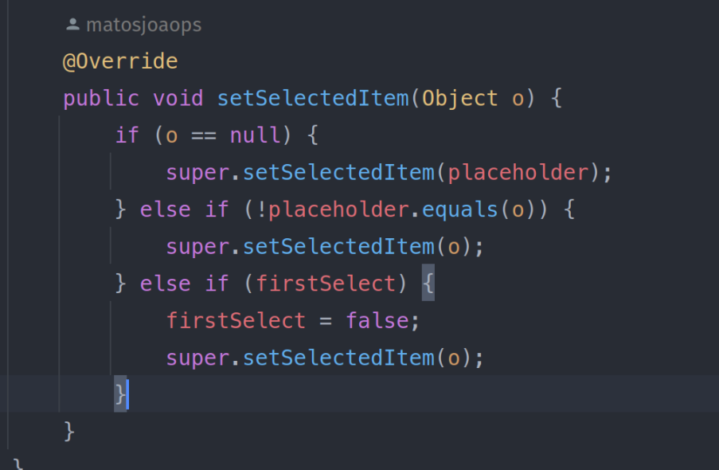

# Assignment #5

## Group Information

- Degree: M.EIC
- Group id: 06
- Project id: 03
- Students:
  - João Matos, up201703884
  - Tiago Gomes, up201806658

## Selected functions

### fileName

This function returns a file's name that is contained in the path that is provided as a parameter. It was chosen because it has multiple conditions and is simple.

### getRelativeDate

This function returns a String representation of the provided date relative to the current time (or at least that's what it claims to do). This function was chosen because it does not have any conditions and receives a `Date` as a parameter.

### setSelectedItem

This function is part of a GUI related class and is used to set the selected item in a combo box. It was chosen because it receives an `Object` as a parameter and has multiple conditions.

## Dataflow Testing

### fileName

#### CFG

#### Paths table

##### path

| pair id | def | use   | path       |
| ------- | --- | ----- | ---------- |
| 1       | 1   | (2,T) | <1,2,3>    |
| 2       | 1   | (2,F) | <1,2,6>    |
| 3       | 1   | (3,T) | <1,2,3,4>  |
| 4       | 1   | (3,F) | <1,2,3,5>  |
| 5       | 1   | 4     | <1,2,3,4>  |
| 6       | 1   | 5     | <1,2,3,5>  |
| 7       | 1   | 7     | <1,2,3,5,7 |
| 8       | 4   | 4     | <4,4>      |
| 9       | 4   | 5     | <4,5>      |
| 10      | 4   | 7     | <4,5,7>    |

##### ind

| pair id | def | use | path  |
| ------- | --- | --- | ----- |
| 1       | 5   | 7   | <5,7> |

### getRelativeDate

#### CFG

#### Paths table

##### date

| pair id | def | use | path    |
| ------- | --- | --- | ------- |
| 1       | 1   | 3   | <1,2,3> |

##### converted

| pair id | def | use | path    |
| ------- | --- | --- | ------- |
| 1       | 2   | 3   | <2,3>   |
| 2       | 2   | 4   | <2,3,4> |

