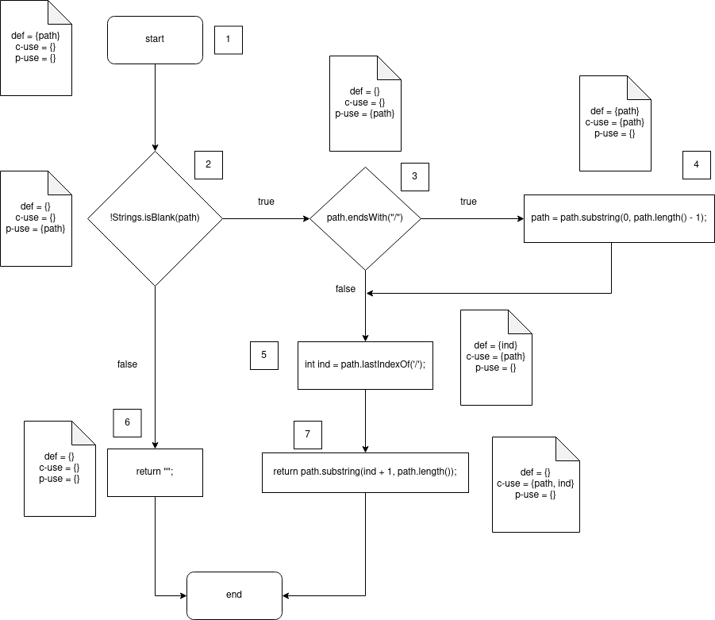
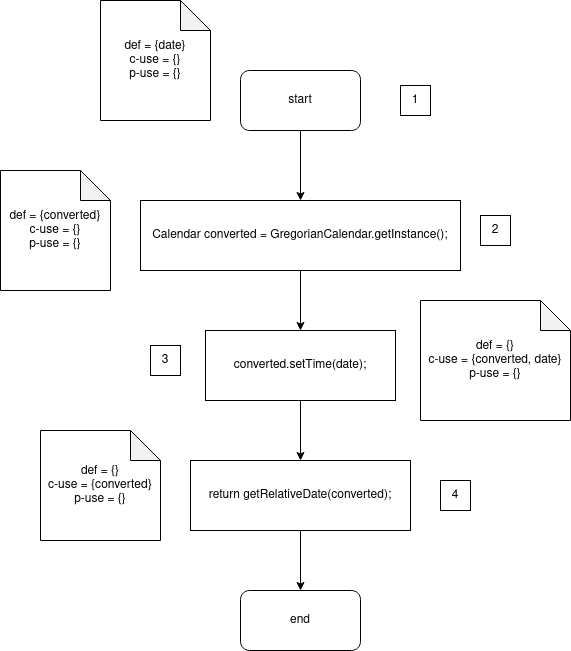
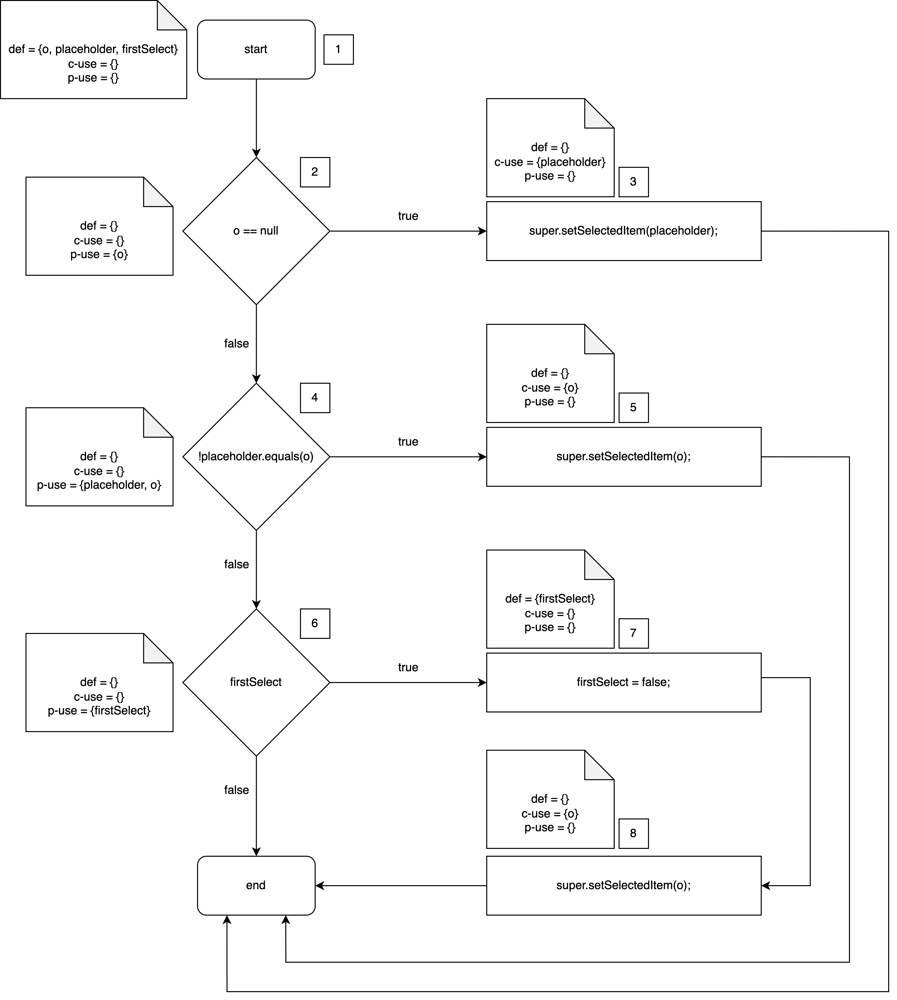

# Assignment #5

## Group Information

- Degree: M.EIC
- Group id: 06
- Project id: 03
- Students:
  - João Matos, up201703884
  - Tiago Gomes, up201806658

## `fileName` function

```java
public static String fileName(String path) {
  if (!Strings.isBlank(path)) {
    // adapted from DropboxAPI.java v1.5.4
    if (path.endsWith("/")) {
      path = path.substring(0, path.length() - 1);
    }
    int ind = path.lastIndexOf('/');
    return path.substring(ind + 1, path.length());
  }
  return "";
}
```

This function returns a file's name that is contained in the path that is provided as a parameter. It was chosen because it has multiple conditions and is simple.

### Dataflow Testing

#### CFG



#### Paths table

##### path

| pair id | def | use   | path       |
| ------- | --- | ----- | ---------- |
| 1       | 1   | (2,T) | <1,2,3>    |
| 2       | 1   | (2,F) | <1,2,6>    |
| 3       | 1   | (3,T) | <1,2,3,4>  |
| 4       | 1   | (3,F) | <1,2,3,5>  |
| 5       | 1   | 4     | <1,2,3,4>  |
| 6       | 1   | 5     | <1,2,3,5>  |
| 7       | 1   | 7     | <1,2,3,5,7 |
| 8       | 4   | 4     | <4,4>      |
| 9       | 4   | 5     | <4,5>      |
| 10      | 4   | 7     | <4,5,7>    |

##### ind

| pair id | def | use | path  |
| ------- | --- | --- | ----- |
| 1       | 5   | 7   | <5,7> |

#### Tests written

For the functions we chose all-uses is equivalent to all-def-use paths, which means we have to test all the paths in all the tables we created for all the functions.

For `fileName` the following tests were created:

- one where `path` is `"/test/path/"`, this covers pair 1 for the `ind` variable as well as pairs 1, 3, 5, 8, 9 and 10 for the `path` variable, the expected output is `"path"`;
- another where `path` is `"/test/file"`, this covers pairs 4, 6 and 7 for the `path` variable, the expected output is `"file"`;
- another where `path` is `""`, this covers pair 2 for the `path` variable, the expected output is `""`.

All the tests pass.

## `getRelativeDate` function

```java
/**
 * This method returns a String representing the relative date by comparing
 * the Date being passed in to the date / time that it is right now.
 *
 * @param date
 * @return String representing the relative date
 */
public static String getRelativeDate(Date date) {
  Calendar converted = GregorianCalendar.getInstance();
  converted.setTime(date);
  return getRelativeDate(converted);
}
```

This function returns a String representation of the provided date relative to the current time (or at least that's what it claims to do). This function was chosen because it does not have any conditions and receives a `Date` as a parameter.

### Dataflow Testing

#### CFG



#### Paths table

##### date

| pair id | def | use | path    |
| ------- | --- | --- | ------- |
| 1       | 1   | 3   | <1,2,3> |

##### converted

| pair id | def | use | path    |
| ------- | --- | --- | ------- |
| 1       | 2   | 3   | <2,3>   |
| 2       | 2   | 4   | <2,3,4> |

#### Tests written

Like previously mentioned, all paths need to be covered. However, due to this function's simplicity, this can be accomplished with a single test. We created an instance of `Date` using the empty constructor, which corresponds to the current date. The expected output should be `"0000-00-00"`. The test fails because this function just returns a string representation of the provided date instead of calculating the relative date.

## `setSelectedItem` function

```java
@Override
public void setSelectedItem(Object o) {
    if (o == null) {
        super.setSelectedItem(placeholder);
    } else if (!placeholder.equals(o)) {
        super.setSelectedItem(o);
    } else if (firstSelect) {
        firstSelect = false;
        super.setSelectedItem(o);
    }
}
```

This function is part of a GUI related class and is used to set the selected item in a combo box. It was chosen because it receives an `Object` as a parameter and has multiple conditions.

### Dataflow Testing

#### CFG



#### Paths table

##### o

| pair id | def | use   | path          |
| ------- | --- | ----- | ------------- |
| 1       | 1   | (2,T) | <1,2,3>       |
| 2       | 1   | (2,F) | <1,2,4>       |
| 3       | 1   | (4,T) | <1,2,4,5>     |
| 4       | 1   | (4,F) | <1,2,4,6>     |
| 5       | 1   | 5     | <1,2,4,5>     |
| 6       | 1   | 8     | <1,2,4,6,7,8> |

##### placeholder

| pair id | def | use | path    |
| ------- | --- | --- | ------- |
| 1       | 1   | 3   | <1,2,3> |
| 2       | 1   | 4   | <1,2,4> |

##### firstSelect

| pair id | def | use   | path        |
| ------- | --- | ----- | ----------- |
| 1       | 1   | (6,T) | <1,2,4,6,7> |
| 2       | 1   | (6,F) | <1,2,4,6>   |

#### Tests written

Like previously mentioned, all paths need to be covered. To satisfy this requirement, the following tests were created:

- `o` is null. This covers the pair 1 for the `o` variable and pair 1 for the `firstSelected` variable. The expected result is that the selected item is set to the `placeholder` value;
- `placeholder` is not equal to `o` and `o` is not null. This covers pairs 2, 3 and 5 for the `o` variable and pair 2 for the `placeholder` variable. The expected result is that the selected item is set to the `o` value;
- `firstSelect` is `true`, `placeholder` is equal to `o` and `o` is not null. This covers pairs 4 and 6 for the `o` variable and pairs 1 and 2 for the `firstSelect` variable. The expected result is that `firstSelected` is set to `false` and the selected item is set to the `o` value.

All tests pass.
